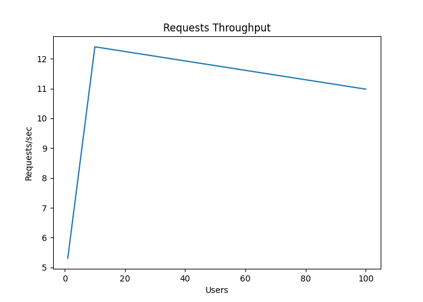

# HW02 Report 

---
## Before Index

### Query Explain
```sql
mysql> explain SELECT * FROM users WHERE last_name like "l%" and first_name like "t%" ORDER BY id LIMIT 1000000 OFFSET 0;
+----+-------------+-------+------------+-------+---------------+---------+---------+------+--------+----------+-------------+
| id | select_type | table | partitions | type  | possible_keys | key     | key_len | ref  | rows   | filtered | Extra       |
+----+-------------+-------+------------+-------+---------------+---------+---------+------+--------+----------+-------------+
|  1 | SIMPLE      | users | NULL       | index | NULL          | PRIMARY | 4       | NULL | 908839 |     1.23 | Using where |
+----+-------------+-------+------------+-------+---------------+---------+---------+------+--------+----------+-------------+

mysql> explain analyze SELECT * FROM users WHERE last_name like "l%" and first_name like "t%" ORDER BY id LIMIT 1000000 OFFSET 0;
-> Limit: 1000000 row(s)
-> Filter: ((users.last_name like 'l%') and (users.first_name like 't%'))
-> Index scan on users using PRIMARY  (cost=100610.19 rows=908839)
```

### Latency – 1 requests


### Latency – 10 requests


### Latency – 100 requests


### Latency – 1000 requests
No data :(

### Requests Throughput


### Transfer Throughput


## After Index
### Description

Я выбрал составной BTREE-индекс на колонки last_name, first_name:
1. В рамках бизнес-логики нужно искать по префиксам, что означает поиск по полуоткрытому интервалу – данный индекс отлично для этого подходит.
2. На первое место в индекс была поставлена колонка last_name, так как эта колонка обладает наибольшей селективностью.
3. На второе место в индекс была поставлена колонка first_name, чтобы задействовать механизм оптимизации ISP (Index Condition Pushdown).

### Adding Index
```sql
mysql> ALTER TABLE users ADD INDEX search_idx (last_name, first_name) USING BTREE;
```

### Query Explain
```sql
mysql> explain SELECT * FROM users WHERE last_name like "l%" and first_name like "t%" ORDER BY id LIMIT 1000000 OFFSET 0;
+----+-------------+-------+------------+-------+---------------+------------+---------+------+--------+----------+--------------------------------------------------+
| id | select_type | table | partitions | type  | possible_keys | key        | key_len | ref  | rows   | filtered | Extra                                            |
+----+-------------+-------+------------+-------+---------------+------------+---------+------+--------+----------+--------------------------------------------------+
|  1 | SIMPLE      | users | NULL       | range | search_idx    | search_idx | 2044    | NULL | 113504 |    11.11 | Using index condition; Using MRR; Using filesort |
+----+-------------+-------+------------+-------+---------------+------------+---------+------+--------+----------+--------------------------------------------------+

mysql> explain analyze SELECT * FROM users WHERE last_name like "l%" and first_name like "t%" ORDER BY id LIMIT 1000000 OFFSET 0;
-> Limit: 1000000 row(s)
-> Sort: users.id, limit input to 1000000 row(s) per chunk
-> Index range scan on users using search_idx, with index condition: ((users.last_name like 'l%') and (users.first_name like 't%'))
```

### Latency – 1 requests


### Latency – 10 requests


### Latency – 100 requests


### Latency – 1000 requests


### Requests Throughput


### Transfer Throughput


## Comparison

### Latency - 1 requests


### Latency - 10 requests


### Latency - 100 requests


### Requests Throughput


### Transfer Throughput
